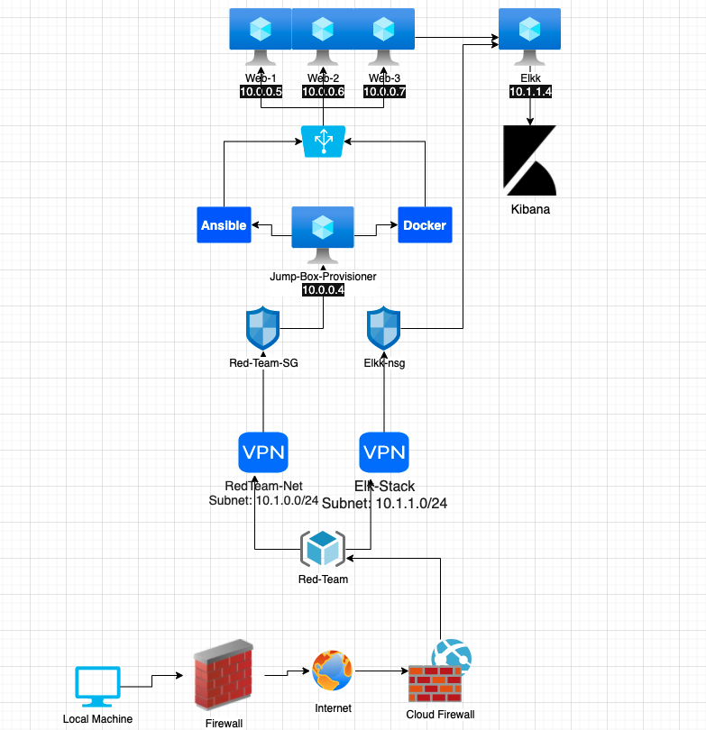
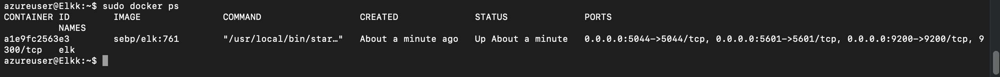

## Automated ELK Stack Deployment

The files in this repository were used to configure the network depicted below.

These files have been tested and used to generate a live ELK deployment on Azure. They can be used to either recreate the entire deployment pictured above. Alternatively, select portions of the _____ file may be used to install only certain pieces of it, such as Filebeat.

  - ---
-
  become: true
  hosts: webservers
  name: "installing and launching filebeat"
  tasks:
    -
      command: "curl -L -O https://artifacts.elastic.co/downloads/beats/filebeat/filebeat-7.4.0-amd64.deb"
      name: "download filebeat deb"
    -
      command: "dpkg -i filebeat-7.4.0-amd64.deb"
      name: "install filebeat .deb"
    -
      copy:
        dest: /etc/filebeat/filebeat.yml
        src: /etc/ansible/files/filebeatconfig.yml
      name: "drop in filebeat.yml"
    -
      command: "filebeat modules enable system"
      name: "enable and configure system module"
    -
      command: "filebeat setup"
      name: "setup filebeat"
    -
      command: "service filebeat start"
      name: "start filebeat service"
    -
      name: "enable service filebeat on boot"
      systemd:
        enabled: filebeat
        name: TODO

This document contains the following details:
- Description of the Topologu
- Access Policies
- ELK Configuration
  - Beats in Use
  - Machines Being Monitored
- How to Use the Ansible Build

### Description of the Topology

The main purpose of this network is to expose a load-balanced and monitored instance of DVWA, the D*mn Vulnerable Web Application.

Load balancing ensures that the application will be highly reliable, in addition to restricting access to the network.
- What aspect of security do load balancers protect? What is the advantage of a jump box? It helps keep connections equal instead of overloading one machine. A jump box allows you to easily connect to any of the web machines quickly and run test on them_

Integrating an ELK server allows users to easily monitor the vulnerable VMs for changes to the network and system logs.
- _TODO: What does Filebeat watch for?_ logs 
- _TODO: What does Metricbeat record?_ mectrics from the operating system

The configuration details of each machine may be found below.
_Note: Use the [Markdown Table Generator](http://www.tablesgenerator.com/markdown_tables) to add/remove values from the table_.

| Name     | Function | IP Address | Operating System |
|----------|----------|------------|------------------|
| Jump Box | Gateway  | 10.0.0.4   | Linux            |
| Web-1    | Web Mac  | 10.0.0.5   | Linux            |
| Web-2    | Web Mac  | 10.0.0.6   | Linux            |
| Web-3    | Web Mac  | 10.0.0.7   | Linux            |

### Access Policies

The machines on the internal network are not exposed to the public Internet. 

Only the JumpBoxProvisioner machine can accept connections from the Internet. Access to this machine is only allowed from the following IP addresses:
- _TODO: 24.241.195.64

Machines within the network can only be accessed by port 5601.
- _TODO: Which machine did you allow to access your ELK VM? What was its IP address?_ Web-3 10.0.0.7

A summary of the access policies in place can be found in the table below.

| Name     | Publicly Accessible | Allowed IP Addresses |
|----------|---------------------|----------------------|
| Jump Box | NO                  | 10.0.0.5 10.0.0.6    |
| Elk      | NO                  | 10.0.0.7             |
|          |                     |                      |

### Elk Configuration

Ansible was used to automate configuration of the ELK machine. No configuration was performed manually, which is advantageous because...
- _TODO: What is the main advantage of automating configuration with Ansible?_ Convenience and knowing that all configurations are exactly the same

The playbook implements the following tasks:
- _TODO: In 3-5 bullets, explain the steps of the ELK installation play. E.g., install Docker; download image; etc._
- Install docker.io
- Install python3-pip
- Increase virtual memory 
- Download and install docker elk container
- Enable docker service 

The following screenshot displays the result of running `docker ps` after successfully configuring the ELK instance.

### Target Machines & Beats
This ELK server is configured to monitor the following machines:
- _TODO: List the IP addresses of the machines you are monitoring_
10.0.0.5, 10.0.0.6, 10.0.0.7
We have installed the following Beats on these machines:
- _TODO: Specify which Beats you successfully installed_
Firebeats
These Beats allow us to collect the following information from each machine:
- _TODO: In 1-2 sentences, explain what kind of data each beat collects, and provide 1 example of what you expect to see. E.g., `Winlogbeat` collects Windows logs, which we use to track user logon events, etc._
Firebeat collects log files and consolodates them into one location. We can expect to see logs that will allow us to know if things have been in the system such as permissions and we can also expect to see a list of commands that are being run by users on the system
### Using the Playbook
In order to use the playbook, you will need to have an Ansible control node already configured. Assuming you have such a control node provisioned: 

SSH into the control node and follow the steps below:
- Copy the elk-playbook.yml file to all of the web vms.
- Update the config file to include the ip address of each of the machines
- Run the playbook, and navigate to each web vm /etc/ansible/files to check that the installation worked as expected.

_TODO: Answer the following questions to fill in the blanks:_
- _Which file is the playbook? Where do you copy it? /etc/firebeat/firebeat-playbook.yml to each web machine in the same file location
- _Which file do you update to make Ansible run the playbook on a specific machine? How do I specify which machine to install the ELK server on versus which to install Filebeat on?_ /etc/ansible/hosts add [elk] above the ips and specify in the playbook "name:"
- _Which URL do you navigate to in order to check that the ELK server is running? http://40.113.241.225/setup.php

_As a **Bonus**, provide the specific commands the user will need to run to download the playbook, update the files, etc._